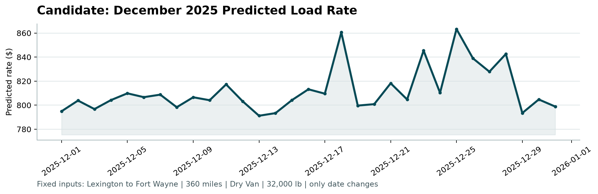

Here is a concise GitHub-ready README with a placeholder notebook path and clear emphasis on opening it in **JupyterLab**.

# Roadway Transport Data Analysis and Freight-Rate Prediction

This repository contains an applied machine-learning analysis of roadway trucking freight-rate prediction. The project covers initial data review, coordinate validation, preprocessing, feature engineering, missing-feature prediction, model comparison, and final freight-rate prediction using several tabular and symbolic-regression approaches.

## Main Notebook

The primary analysis is contained in:

```text
/FreightRatesAnalysisPrediction.ipynb
```

> **Recommended:** Open this notebook with **JupyterLab**, not the classic `jupyter notebook` interface.

From the repository root:

```bash
jupyter lab
```

Then navigate to:

```text
/FreightRatesAnalysisPrediction.ipynb
```

JupyterLab is recommended because the notebook makes extensive use of structured sections, navigation, rendered HTML, tables, and model-analysis output that are easier to work with in the JupyterLab interface.

After opening FreightRatesAnalysisPrediction.ipynb with Jupyter Lab be sure to click the table of contents icon on the top left for easier navigation!

score.py is located in:

```text
/score.py
```

validation_predictions.csv is located in 2 paths:

```text
/validation_predictions.csv
/data/validation_predictions.csv
```

december_chart_inputs.csv is located in 2 paths:

```text
/december_chart_inputs.csv
/data/december_chart_inputs.csv
```

Scoring results:

```text
(score-venv) ~/DataSci2/Dev$ python score.py --predictions data/validation_predictions.csv --december-predictions data/december_chart_inputs.csv
Validated 12,000 final predictions.
Validated 31 fixed December predictions.
Created chart: scorer_results/candidate_december.png
Final validation metrics are calculated by Spotter after submission.

(score-venv) ~/DataSci2/Dev$ python score.py --predictions validation_predictions.csv --december-predictions data/december_chart_inputs.csv
Validated 12,000 final predictions.
Validated 31 fixed December predictions.
Created chart: scorer_results/candidate_december.png
Final validation metrics are calculated by Spotter after submission.
```




## Project Overview

The workflow begins with a detailed review of the supplied freight data and progresses through preprocessing and feature engineering before evaluating multiple predictive-modeling approaches. Particular attention is given to missing `market_index` and `quote_signal` values, both of which are modeled before the final `posted_rate` prediction stage.

Models evaluated include:

* FastAI
* CatBoost
* TabPFN 3
* TabICLv2
* LightGBM
* PySR
* Median imputation baseline

TabICLv2 produced the strongest predictive performance during the initial model-comparison work and was subsequently used for prediction of `market_index`, `quote_signal`, and final freight rates.

## Analysis Structure

### 0. Preliminary Material

* Module imports
* Hardware environment
* Python environment
* CUDA configuration
* GPU environment

### 1.0 Initial Data Review

* Review dataset dimensions
* Review columns and data types
* Check string columns for leading, trailing, and internal whitespace
* Identify columns containing missing data
* Analyze missing weight values
* Analyze `market_index`
* Analyze equipment categories
* Analyze `quote_signal`
* Analyze date values
* Check for duplicate rows and duplicate `load_id` values
* Validate `load_id` formatting
* Examine correlation and categorical/numerical association

### 2.0 Coordinates Review and Analysis

* Review coordinate validity
* List unique cities
* Map cities to city-center coordinates
* Determine whether pickup and delivery cities map consistently to latitude/longitude pairs

### 3.0 Preprocessing

The preprocessing stage prepares the original data for feature engineering and model training. This includes handling missing identifiers and coordinates, cleaning weight-related values, creating imputed weight representations, and removing unsuitable or leakage-prone columns.

### 4.0 Feature Engineering

#### 4.1 Derive New Features

The feature-engineering stage expands the source data with geographic, temporal, operational, weather, insurance-risk, fuel-price, crude-oil, and route-related variables.

#### 4.2 Feature Prediction Testing

Several models are evaluated for their ability to reconstruct missing `market_index` and `quote_signal` values.

* FastAI — `market_index`
* CatBoost — `market_index`
* TabPFN 3 — `market_index`
* TabICLv2 — `market_index`
* LightGBM — `market_index`
* PySR — `market_index`
* TabICLv2 — `quote_signal`
* Median imputation baseline

#### 4.3 Feature Review

* Review engineered dataset shape
* Inspect dataset head and tail
* Review feature columns and data types
* Check remaining missing values
* Check for temporal data leakage
* Analyze correlation and association across engineered features

### 5.0 Freight-Rate Prediction

#### 5.1 TabICLv2 Model Training

TabICLv2 is trained to predict the final freight-rate target.

#### 5.2 Validation Dataset

The trained model is applied to `validation.csv`.

* Generate predicted freight rates
* Review prediction results

#### 5.3 December Chart Inputs

The prediction pipeline is also applied to `december_chart_inputs.csv`.

* Predict `market_index`
* Predict `quote_signal`
* Generate final freight-rate predictions
* Review prediction results

## Initial TabICLv2 Results

| Prediction Target | Testing R² |
| ----------------- | ---------: |
| `market_index`    |   0.978141 |
| `quote_signal`    |   0.913831 |
| `posted_rate`     |   0.860776 |

These initial results indicate particularly strong reconstruction of `market_index`, strong prediction of `quote_signal`, and substantial predictive capacity for the final roadway freight-rate target.

## Conclusion

The project demonstrates an end-to-end freight-rate modeling workflow that moves from raw-data validation through feature engineering and missing-feature reconstruction to final rate prediction. The initial results indicate that the engineered feature set captures a substantial portion of the structure underlying roadway freight prices, with TabICLv2 providing the strongest overall predictive performance among the models tested.

## Room for Improvement and Next Steps

Further work should focus on increasing the amount of real-world operational and market information available to the models and on testing more adaptive modeling strategies.

* Improve fuel features with more accurate, localized, and relevant fuel price data
* Engineer features from GPS and vehicle
* Integrate vehicle telemetry such as speed, idle time, fuel efficiency, engine load, braking, and utilization measures.
* Add commodity futures and related market data to better account for costs.
* Test reinforcement-learning approaches for dynamic freight-rate estimation.capture current and forward-looking sensor data.

